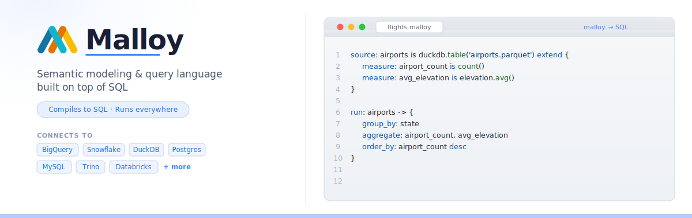

<div align="center">

# Malloy

**A modern semantic modeling and query language built on top of SQL**

[](https://github.com/malloydata/malloy/actions/workflows/run-tests.yaml)
[](https://opensource.org/licenses/MIT)
[](https://nodejs.org)
[](https://www.npmjs.com/package/@malloydata/malloy)
[](https://www.npmjs.com/package/@malloydata/malloy)
[](https://github.com/malloydata/malloy/stargazers)

[Try in Browser](https://github.dev/malloydata/try-malloy/airports.malloy) · [Quickstart](https://docs.malloydata.dev/documentation/user_guides/basic.html) · [Docs](https://docs.malloydata.dev/documentation/) · [Slack](https://malloydata.github.io/slack) · [YouTube](https://www.youtube.com/channel/UCfN2td1dzf-fKmVtaDjacsg)

<picture>
  <source media="(prefers-color-scheme: dark)" srcset=".github/images/hero-dark.svg">
  
</picture>

</div>

---

## What is Malloy?

Malloy is an open source language for describing **data relationships and transformations**.

It is both a **semantic modeling layer** and a **query language** that compiles down to SQL and runs on your existing data warehouse. Think of it as "SQL with a type system for your data" — define your measures, joins, and business logic once, then compose them freely without copy-pasting SQL snippets.

**Supported backends:** BigQuery · Snowflake · DuckDB · MotherDuck · PostgreSQL · MySQL · Trino · Presto · Databricks · MSSQL (experimental)

---

## Who Malloy Is For

- **Analytics engineers and data teams** who want reusable measures, dimensions, joins, and views without scattering business logic across SQL files and dashboards.
- **SQL users** who need a more composable way to express analysis while still compiling to SQL that runs in their existing warehouse.
- **Teams working with nested data** who want first-class support for arrays, records, and nested query results instead of repeated unnesting boilerplate.
- **Developers building data applications or BI experiences** who need a semantic model, query language, and rendering-friendly result shapes in one open source stack.

---

## Why Malloy?

SQL gives you maximum freedom but no guardrails — joins get duplicated, aggregations silently fan out, and measures drift across dashboards. Existing semantic layers add safety but lock you into their query model. Malloy gives you both: **the safety of a semantic data model with the full flexibility of a relational query language.**

<p>
  <em>“This feels like magic.”</em> — Lloyd Tabb
</p>


| Pain point | How Malloy solves it |
|---|---|
| Joins duplicated everywhere | Define joins once in a source, reuse across every query |
| Aggregation fans out silently | Symmetric aggregates make `count()`, `sum()`, and `avg()` fan-out safe by default |
| Measures drift across dashboards | Single source of truth — change a measure once, every query updates |
| Nested data requires boilerplate | First-class support for nested and repeated fields, no unnesting required |
| Multi-step transforms are hard to read | Pipe operator `->` chains transformations linearly, like a Unix pipeline |

---

## How Does Malloy Compare?

| Tool | Key difference from Malloy |
|---|---|
| **Raw SQL** | No semantic layer - measures are copy-pasted into every query; fan-out bugs are silent |
| **LookML** | Proprietary and locked to Looker; Malloy is open source and targets any SQL warehouse |
| **dbt metrics / MetricFlow** | Definition-only; you still write SQL to consume metrics — Malloy is a full query language |
| **Cube** | JavaScript/YAML configuration; Malloy is a typed, composable query language |

---

## Quick Start

Three independent paths — pick whichever fits your setup:

### Install the VSCode Extension

The fastest path to Malloy — install the Malloy extension directly from the VSCode Marketplace:

- **[Install the Malloy extension in VSCode](https://docs.malloydata.dev/documentation/setup/extension.html#installation)**
- **[Try it in the browser first (no install)](https://github.dev/malloydata/try-malloy/airports.malloy)** — opens a live Malloy notebook in github.dev, GitHub's in-browser VSCode. Requires a GitHub sign-in.
- **[Connect to your database](https://docs.malloydata.dev/documentation/setup/extension.html#database-specific-setup)** — BigQuery, Snowflake, DuckDB, Postgres, MySQL, Trino/Presto, MotherDuck


### Run from the command line

For scripting, pipelines, or CI — install the standalone Malloy CLI:

```bash
npm install -g malloy-cli
malloy-cli run my_query.malloy
```

It can `run` queries, `compile` to SQL, and `build` persistent tables from sources marked `#@ persist`. Connections are configured in `~/.config/malloy/malloy-config.json` (DuckDB, BigQuery, Postgres, Snowflake, Trino, Presto). See the [Malloy CLI docs](https://docs.malloydata.dev/documentation/malloy_cli/index) and [malloy-cli repo](https://github.com/malloydata/malloy-cli).

### Use the npm packages

Install the compiler and a database connector:

```bash
npm install @malloydata/malloy @malloydata/db-duckdb
```

Run a query from Node.js:

```javascript
const malloy = require("@malloydata/malloy");
const duckdb = require("@malloydata/db-duckdb");

const connection = new duckdb.DuckDBConnection("duckdb");
const runtime = new malloy.SingleConnectionRuntime({ connection });

const query = runtime.loadQuery(`
  run: duckdb.sql('SELECT 1 AS one UNION ALL SELECT 2 AS one') -> {
    aggregate: total is sum(one)
  }
`);

query.run().then(result => console.log(result.data.value));
// [ { total: 3 } ]
```

See the [language docs](https://docs.malloydata.dev/documentation/) for the full SDK reference and more examples.

---

## Language at a Glance

Malloy compiles to SQL. Here is what a query looks like side by side:

**Malloy**
```malloy
run: bigquery.table('malloydata-org.faa.flights') -> {
  where: origin = 'SFO'
  group_by: carrier
  aggregate:
    flight_count is count()
    average_flight_time is flight_time.avg()
}
```

**Equivalent SQL**
```sql
SELECT
  carrier,
  COUNT(*)           AS flight_count,
  AVG(flight_time)   AS average_flight_time
FROM `malloydata-org.faa.flights`
WHERE origin = 'SFO'
GROUP BY carrier
ORDER BY flight_count DESC  -- Malloy orders by first aggregate automatically
```

Malloy's real power is **defining a model once and reusing it everywhere**. Measures, joins, and dimensions live in the source — not scattered across queries:

```malloy
-- Define once
source: flights is bigquery.table('malloydata-org.faa.flights') extend {
  measure:
    flight_count is count()
    avg_flight_time is flight_time.avg()
}

-- Query by carrier — measures reused, no copy-paste
run: flights -> {
  group_by: carrier
  aggregate: flight_count, avg_flight_time
}

-- Query by origin — same measures, zero duplication
run: flights -> {
  group_by: origin
  aggregate: flight_count, avg_flight_time
}
```

Change `avg_flight_time` once in the source and every query that uses it updates automatically. The [language guide](https://docs.malloydata.dev/documentation/user_guides/basic.html) walks through this in depth.

---

## Examples

| Example | What it shows |
|---|---|
| [Build a semantic model](https://docs.malloydata.dev/documentation/user_guides/quickstart_modeling) | Define sources, joins, dimensions, and measures once, then reuse them across queries |
| [Percent of total](https://docs.malloydata.dev/documentation/patterns/percent_of_total) | Express common analytics patterns with reusable calculations instead of window-function-heavy SQL |
| [Nested subtotals](https://docs.malloydata.dev/documentation/patterns/nested_subtotals) | Drill from high-level totals into nested detail without hand-writing rollups or self-joins |

---

## Key Features

- **Semantic model** — capture joins, measures, and dimensions once; query them everywhere
- **Composable pipelines** — chain transformations with `->` for readable multi-step analysis
- **Nested data** — query arrays and structs naturally without unnesting boilerplate
- **Symmetric aggregates** — fan-out safe `count()`, `sum()`, and `avg()` across any join path
- **Multi-dialect SQL output** — one model targets BigQuery, Snowflake, DuckDB, and more
- **VSCode integration** — schema explorer, inline results, and syntax highlighting

---

## Packages

This monorepo ships the core compiler, database connectors, and rendering utilities as separate npm packages:

| Package | Description |
|---|---|
| [`@malloydata/malloy`](https://www.npmjs.com/package/@malloydata/malloy) | Core compiler & runtime |
| [`@malloydata/db-duckdb`](https://www.npmjs.com/package/@malloydata/db-duckdb) | DuckDB connector (also supports MotherDuck and MSSQL via extensions) |
| [`@malloydata/db-bigquery`](https://www.npmjs.com/package/@malloydata/db-bigquery) | BigQuery connector |
| [`@malloydata/db-snowflake`](https://www.npmjs.com/package/@malloydata/db-snowflake) | Snowflake connector |
| [`@malloydata/db-postgres`](https://www.npmjs.com/package/@malloydata/db-postgres) | PostgreSQL connector |
| [`@malloydata/db-mysql`](https://www.npmjs.com/package/@malloydata/db-mysql) | MySQL connector |
| [`@malloydata/db-trino`](https://www.npmjs.com/package/@malloydata/db-trino) | Trino / Presto connector |
| [`@malloydata/db-databricks`](https://www.npmjs.com/package/@malloydata/db-databricks) | Databricks connector |
| [`@malloydata/render`](https://www.npmjs.com/package/@malloydata/render) | Result rendering / charting |

---

## Documentation

| Resource | Description |
|---|---|
| [Language Reference](https://docs.malloydata.dev/documentation/) | Full language guide |
| [Quickstart](https://docs.malloydata.dev/documentation/user_guides/basic.html) | 10-minute tour |
| [Malloy by Example](https://docs.malloydata.dev/documentation/user_guides/malloy_by_example) | Advanced modeling patterns and idioms |
| [Malloy CLI](https://docs.malloydata.dev/documentation/malloy_cli/index) | Command-line reference for `run`, `compile`, `build` |
| [YouTube Channel](https://www.youtube.com/channel/UCfN2td1dzf-fKmVtaDjacsg) | Video demos and walkthroughs |

---

## Roadmap

See [`ROADMAP.md`](ROADMAP.md) for the public roadmap and upcoming priorities.

Have a feature request? Open a [GitHub issue](https://github.com/malloydata/malloy/issues/new/choose) or start a conversation in [Slack](https://malloydata.github.io/slack).

---

## Community

- **[Slack](https://malloydata.github.io/slack)** — ask questions, share models, meet other users
- **[GitHub Discussions](https://github.com/malloydata/malloy/discussions)** — longer-form conversations and RFCs
- **[GitHub Issues](https://github.com/malloydata/malloy/issues)** — bug reports and feature requests
- **[YouTube](https://www.youtube.com/channel/UCfN2td1dzf-fKmVtaDjacsg)** — demos and tutorials

> Note: The Malloy VSCode Extension collects a small amount of anonymous usage data. You can opt out in the extension settings. [Learn more](https://policies.google.com/technologies/cookies).

---

## Contributing

We welcome contributions of all kinds — bug fixes, new database connectors, documentation, and examples.

1. Read [`CONTRIBUTING.md`](CONTRIBUTING.md) for licensing and DCO requirements
2. Read [`developing.md`](developing.md) to set up your local environment
3. Pick up an issue tagged [`good first issue`](https://github.com/malloydata/malloy/issues?q=is%3Aopen+is%3Aissue+label%3A%22good+first+issue%22) or propose something new in Slack

---

## Security

To report a security vulnerability, please follow our [Security Policy](SECURITY.md) rather than opening a public issue.

---

## License

Malloy is released under the [MIT License](LICENSE).
