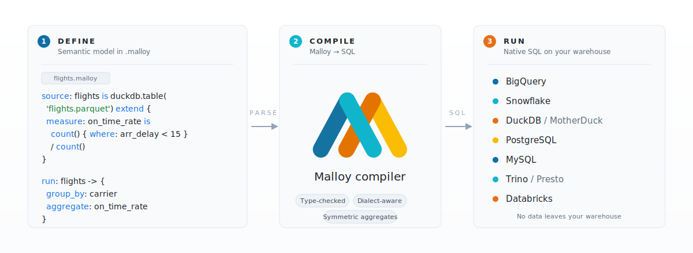

<div align="center">

# Malloy

**A semantic modeling and query language built on top of SQL**

[](https://github.com/malloydata/malloy/actions/workflows/run-tests.yaml)
[](https://opensource.org/licenses/MIT)
[](https://nodejs.org)
[](https://www.npmjs.com/package/@malloydata/malloy)
[](https://www.npmjs.com/package/@malloydata/malloy)
[](https://github.com/malloydata/malloy/stargazers)

[Try in Browser](https://github.dev/malloydata/try-malloy/airports.malloy) · [Quickstart](https://docs.malloydata.dev/documentation/user_guides/basic.html) · [Docs](https://docs.malloydata.dev/documentation/) · [Slack](https://malloydata.github.io/slack) · [YouTube](https://www.youtube.com/channel/UCfN2td1dzf-fKmVtaDjacsg)


</div>

---

## What is Malloy?

Malloy is an open source language for describing data relationships and transformations. It is both a semantic modeling layer and a query language that compiles to SQL. Malloy doesn't replace SQL; it adds a layer of **meaning** that runs on your existing data warehouse. Define your measures, joins, and business logic once, then reuse them without copy-pasting SQL snippets across queries and dashboards.

**Supported SQL engines:** BigQuery · Snowflake · DuckDB · MotherDuck · PostgreSQL · MySQL · Trino · Presto · Databricks

Malloy is built for analytics engineers, SQL teams, and developers building data apps who need measures, joins, and views to mean the same thing across every dashboard, notebook, and pipeline, especially when the data is nested.

SQL gives you maximum flexibility, which is what you want when one analyst is asking one-off questions. On a team, that same flexibility produces duplicated joins, fan-out bugs, and measures that drift across dashboards or applications.

Concretely:

| Pain point | How Malloy solves it |
|---|---|
| Joins duplicated everywhere | Define joins once in a source, reuse across every query |
| Aggregation fans out silently | Symmetric aggregates make `count()`, `sum()`, and `avg()` fan-out safe |
| Measures drift across dashboards | Define each measure once; change it in one place and every query reflects it |
| Nested data requires boilerplate | Native nested and repeated fields, no unnesting required |
| Multi-step transforms are hard to read | Pipe operator `->` chains transformations, like a Unix pipeline |

<br>
<p>
  <em>“This feels like magic.”</em> -- Lloyd Tabb
</p>


---

## How Malloy Works

<picture>
  <source media="(prefers-color-scheme: dark)" srcset=".github/images/how-it-works-dark.svg">
  
</picture>

---

## Quick Start

There are four ways to install Malloy:

### Install the VSCode Extension

The easiest way to try Malloy is the [VSCode Extension](https://docs.malloydata.dev/documentation/setup/extension.html#installation). You can do this locally, or [try it in the browser (no install)](https://github.dev/malloydata/try-malloy/airports.malloy), which opens a live Malloy notebook in github.dev (GitHub's in-browser VSCode; requires a GitHub sign-in).

Follow the instructions for [connecting Malloy to your database](https://docs.malloydata.dev/documentation/setup/extension.html#database-specific-setup). Supports BigQuery, Snowflake, DuckDB, MotherDuck, PostgreSQL, MySQL, Trino, Presto, or Databricks.


> Note: The Malloy VSCode Extension collects a small amount of anonymous usage data. You can opt out in the extension settings. [Learn more](https://policies.google.com/technologies/cookies).

### Use the npm packages

To use Malloy in Node.js, install the compiler and a database connector. For example:

```bash
npm install @malloydata/malloy @malloydata/db-duckdb
```

Run a query from Node.js:

```javascript
const malloy = require("@malloydata/malloy");
const duckdb = require("@malloydata/db-duckdb");

const connection = new duckdb.DuckDBConnection("duckdb");
const runtime = new malloy.SingleConnectionRuntime({ connection });

const query = runtime.loadQuery(`
  run: duckdb.sql('SELECT 1 AS one UNION ALL SELECT 2 AS one') -> {
    aggregate: total is sum(one)
  }
`);

query.run().then(result => console.log(result.data.value));
// [ { total: 3 } ]
```

### Run Malloy from the command line

For scripting, pipelines, or CI, install the standalone Malloy CLI:

```bash
npm install -g malloy-cli
malloy-cli run my_query.malloy
```

It can `run` queries, `compile` to SQL, and `build` persistent tables from sources marked `#@ persist`.<br>
Connections are configured in `~/.config/malloy/malloy-config.json` (BigQuery, Snowflake, DuckDB, PostgreSQL, MySQL, Trino, Presto, Databricks; MotherDuck via DuckDB).<br>

See the [Malloy CLI docs](https://docs.malloydata.dev/documentation/malloy_cli/index) and [malloy-cli repo](https://github.com/malloydata/malloy-cli) for more details about using the CLI

### Serve models with Publisher

[Publisher](https://github.com/malloydata/publisher) is the open-source semantic model server for Malloy. It serves your `.malloy` models through REST and MCP APIs so apps, BI tools, and AI agents can query them through one interface:

```bash
npx @malloy-publisher/server --port 4000 --server_root path/to/your/models
```

Open `http://localhost:4000` to browse models, run queries, and grab MCP endpoints. See the [Publisher repo](https://github.com/malloydata/publisher) for setup, sample models, and deployment options.

---

## How Does Malloy Compare?

| Tool | Key difference from Malloy |
|---|---|
| **Raw SQL** | No semantic layer; measures are copy-pasted into every query and fan-out bugs are silent |
| **LookML** | Proprietary and locked to Looker; Malloy is open source and targets any SQL warehouse |
| **dbt metrics / MetricFlow** | Definition-only; you still write SQL to consume metrics. Malloy is a full query language |
| **Cube** | JavaScript/YAML configuration; Malloy is a typed, composable query language |

---

## The Malloy Language at a Glance

SQL is the right tool for ad-hoc, single-analyst exploration against one table. Malloy is for the case where several analysts share a warehouse and the definition of "active user" (for example) has to be the same in every dashboard. Because it compiles to SQL, joins, measures, and business rules live in one place and feed every query downstream.

A bare Malloy query reads like an outline of what you want:

**Malloy**
```malloy
run: duckdb.table('airports.parquet') -> {
  group_by: state
  aggregate:
    airport_count is count()
    avg_elevation is elevation.avg()
}
```

**Equivalent SQL**
```sql
SELECT state, COUNT(*) AS airport_count, AVG(elevation) AS avg_elevation
FROM 'airports.parquet'
GROUP BY state
ORDER BY airport_count DESC  -- Malloy orders by first aggregate automatically
```

Malloy is most useful for pinning down measures whose definitions aren't obvious. Take "on-time arrival" - the US DOT defines it as `arr_delay < 15` *with cancelled and diverted flights excluded*. A naive `count() { where: arr_delay < 15 } / count()` silently treats cancellations as on-time. Encode the rule once, and every dashboard, report, and ad-hoc query agrees:

```malloy
source: flights is duckdb.table('flights.parquet') extend {
  measure:
    on_time_rate is
      count() { where: cancelled = 'N' and diverted = 'N' and arr_delay < 15 }
      /
      count() { where: cancelled = 'N' and diverted = 'N' }
}
```

These are two simple examples. The [10-minute quickstart](https://docs.malloydata.dev/documentation/user_guides/basic.html) and [Malloy by Example](https://docs.malloydata.dev/documentation/user_guides/malloy_by_example) cover additional topics like joins, nested results, symmetric aggregates, and the pipe operator.

---

## Packages

This monorepo ships the core compiler, database connectors, and rendering utilities as separate npm packages:

| Package | Description |
|---|---|
| [`@malloydata/malloy`](https://www.npmjs.com/package/@malloydata/malloy) | Core compiler & runtime |
| [`@malloydata/db-duckdb`](https://www.npmjs.com/package/@malloydata/db-duckdb) | DuckDB connector (also supports MotherDuck and MSSQL via extensions) |
| [`@malloydata/db-bigquery`](https://www.npmjs.com/package/@malloydata/db-bigquery) | BigQuery connector |
| [`@malloydata/db-snowflake`](https://www.npmjs.com/package/@malloydata/db-snowflake) | Snowflake connector |
| [`@malloydata/db-postgres`](https://www.npmjs.com/package/@malloydata/db-postgres) | PostgreSQL connector |
| [`@malloydata/db-mysql`](https://www.npmjs.com/package/@malloydata/db-mysql) | MySQL connector |
| [`@malloydata/db-trino`](https://www.npmjs.com/package/@malloydata/db-trino) | Trino / Presto connector |
| [`@malloydata/db-databricks`](https://www.npmjs.com/package/@malloydata/db-databricks) | Databricks connector |
| [`@malloydata/render`](https://www.npmjs.com/package/@malloydata/render) | Result rendering / charting |

---

## Documentation

| Resource | Description |
|---|---|
| [Language Reference](https://docs.malloydata.dev/documentation/) | Full language guide |
| [Quickstart](https://docs.malloydata.dev/documentation/user_guides/basic.html) | 10-minute tour |
| [Malloy by Example](https://docs.malloydata.dev/documentation/user_guides/malloy_by_example) | Advanced modeling patterns and idioms |
| [Malloy CLI](https://docs.malloydata.dev/documentation/malloy_cli/index) | Command-line reference for `run`, `compile`, `build` |
| [YouTube Channel](https://www.youtube.com/channel/UCfN2td1dzf-fKmVtaDjacsg) | Video demos and walkthroughs |

---

## Community

- **[Slack](https://malloydata.github.io/slack)**: ask questions, share models, meet other users
- **[GitHub Discussions](https://github.com/malloydata/malloy/discussions)**: longer-form conversations and RFCs
- **[GitHub Issues](https://github.com/malloydata/malloy/issues)**: bug reports and feature requests
- **[YouTube](https://www.youtube.com/channel/UCfN2td1dzf-fKmVtaDjacsg)**: demos and tutorials

---

## Contributing

We welcome bug fixes, new database connectors, documentation, and examples.

1. Read [`CONTRIBUTING.md`](CONTRIBUTING.md) for licensing and DCO requirements
2. Read [`developing.md`](developing.md) to set up your local environment
3. Pick up an issue tagged [`good first issue`](https://github.com/malloydata/malloy/issues?q=is%3Aopen+is%3Aissue+label%3A%22good+first+issue%22) or propose something new in Slack

---

## Security

To report a security vulnerability, please follow our [Security Policy](SECURITY.md) rather than opening a public issue.

---

## License

Malloy is released under the [MIT License](LICENSE).
